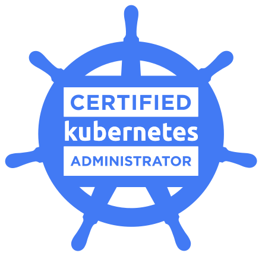

# 👋 Howdy, I'm Jeremy Novak

I'm a software developer working from our beautiful farm in Oklahoma. I love to learn something new and use my 
skills and experience to solve problems and build cool things. Please reach out if you would like to connect.  

## Skills

**Programming Languages:** Go, Python, Rust    
**Technologies, Tools and Platforms:** Git, GitHub, GitLab, Kubernetes, Linux, GCP, AWS, Terraform   

## Certifications

    
    
    

## AFK

Away from keyboard I am a horseman and amatuer BBQ cook.
